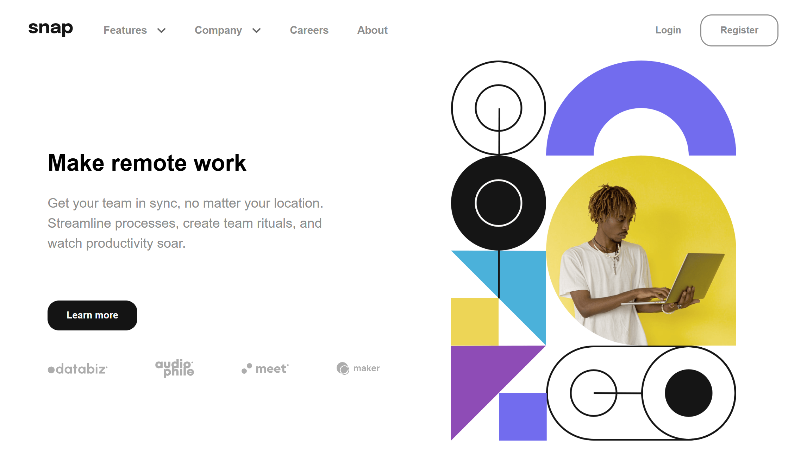

# Frontend Mentor - Intro section with dropdown navigation solution

This is a solution to the [Intro section with dropdown navigation challenge on Frontend Mentor](https://www.frontendmentor.io/challenges/intro-section-with-dropdown-navigation-ryaPetHE5). Frontend Mentor challenges help you improve your coding skills by building realistic projects.

## Table of contents

- [Overview](#overview)
  - [The challenge](#the-challenge)
  - [Screenshot](#screenshot)
  - [Links](#links)
- [My process](#my-process)
  - [Built with](#built-with)
  - [What I learned](#what-i-learned)
  - [Continued development](#continued-development)
- [Author](#author)

## Overview

### The challenge

Users should be able to:

- View the relevant dropdown menus on desktop and mobile when interacting with the navigation links
- View the optimal layout for the content depending on their device's screen size
- See hover states for all interactive elements on the page

### Screenshot

- Desktop View



### Links

- Solution URL: [GitHub Repo](https://github.com/jonmc89/intro-section-with-dropdown-navigation-main)
- Live Site URL: [Live Demo](https://jonmc89.github.io/intro-section-with-dropdown-navigation-main/)

## My process

### Built with

- Semantic HTML5 markup
- CSS custom properties
- Flexbox
- CSS Grid
- Mobile-first workflow

### What I learned

I learned how to implement a toggle state for the drop down menus for both the mobile view and desktop view.

To see how you can add code snippets, see below:

```js
featureArrow.addEventListener("click", () => {
  const isCollapsed = featuresContainer.classList.contains("feature-collapse");

  if (isCollapsed) {
    featureSection.classList.remove("collapse-features");
    featuresContainer.classList.remove("feature-collapse");
    featureArrow.classList.remove("arrow-rotate");
  } else {
    featureSection.classList.add("collapse-features");
    featuresContainer.classList.add("feature-collapse");
    featureArrow.classList.add("arrow-rotate");
  }
});
```

### Continued development

I would like to add a more smoother transition from collapses and un collapsed.

## Author

- Frontend Mentor - [@jonmc89](https://www.frontendmentor.io/profile/jonmc89)
